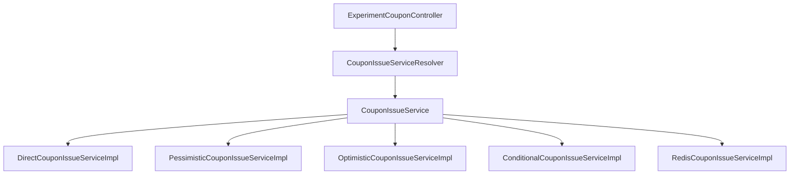

# 동시성 실험 공통 코드 구조

## 1. 개요

여러 쿠폰 발급 동시성 전략을 동일한 API와 데이터 모델에서 비교하기 위해 공통 인터페이스와 전략 선택 구조를 구성한다.

공통 코드의 주요 목적은 다음과 같다.

- 전략별 구현 분리
- 동일한 API 사용
- 동일한 요청/응답 모델 사용
- 전략 동적 선택
- 공통 예외 응답
- 동일한 기준의 실험 상태 조회

---

## 2. 전체 구조

---

