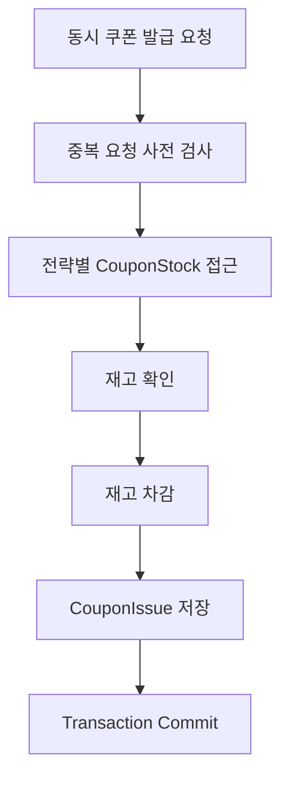

# 쿠폰 발급 동시성 실험

## 1. 실험 배경

한정된 수량의 쿠폰에 다수의 사용자가 동시에 발급 요청을 보내는 상황에서는 동일한 재고를 여러 트랜잭션이 동시에 조회하고 수정할 수 있다.

이 과정에서 적절한 동시성 제어가 없다면 다음과 같은 문제가 발생할 수 있다.

- 재고 초과 발급
- Lost Update
- 재고 수량과 실제 발급 건수 불일치
- 동일 사용자 중복 발급
- 동일 요청 중복 처리

본 실험에서는 여러 동시성 제어 전략을 동일한 조건에서 실행하고 데이터 정합성과 성능을 비교한다.

---

## 2. 실험 목적

본 실험의 주요 목적은 다음과 같다.

1. 동시 요청 상황에서 발생할 수 있는 재고 정합성 문제를 확인한다.
2. 각 동시성 제어 전략이 데이터 정합성을 보장하는지 검증한다.
3. 동일한 환경에서 전략별 처리 성능을 비교한다.
4. 각 전략의 장단점과 적합한 사용 상황을 분석한다.

---

## 3. 비교 전략

| 전략 | 설명 |
|---|---|
| DIRECT | 별도의 동시성 제어 없이 발급 | 
| PESSIMISTIC | DB Pessimistic Write Lock 사용 |
| OPTIMISTIC | Version 기반 충돌 감지 |
| CONDITIONAL | 조건부 UPDATE 기반 재고 차감 | 
| REDIS | Redis 기반 동시성 제어 | 

> [!NOTE]
> 별도의 방식이 추가되면 변경한다.

---

## 4. 공통 실험 조건

모든 전략은 가능한 한 동일한 환경에서 실행한다.

| 항목 | 값 |
|---|---:|
| 초기 쿠폰 재고 | 100 |
| 전체 요청 수 | 200 |
| Worker 수 | 200 |
| 사용자 수 | 200 |
| 사용자 | 요청별 서로 다른 사용자 |
| requestId | 요청별 고유 값 |
| Database | MySQL |
| 1인 발급 제한 | 1 |

각 요청에서 서로 다른 `userId`와 `requestId`를 사용한다.

이를 통해 중복 요청 검사가 먼저 요청을 제거하는 것을 방지하고, 실제로 동일한 `CouponStock`에 대한 재고 경쟁이 발생하도록 한다.

---

## 5. 실험 요청 흐름



전략별 차이는 주로 `CouponStock`에 접근하고 재고를 변경하는 과정에서 발생한다.

---

## 6. 검증할 불변식

### 6.1 초과 발급 금지

```text
issueCount <= totalQuantity
```

### 6.2 재고 음수 금지

```text
remainingQuantity >= 0
```

### 6.3 실제 발급 건수와 재고 차감 수 일치

```text
issueCount
=
totalQuantity - remainingQuantity
```

### 6.4 발급 수량과 실제 발급 Row 수 일치

```text
issuedQuantity
=
issueCount
```

### 6.5 동일 사용자 중복 발급 금지

```text
(couponId, userId) UNIQUE
```

### 6.6 동일 요청 중복 처리 금지

```text
requestId UNIQUE
```

---

## 7. 중복 요청 처리

발급 전에 다음 항목을 사전 검사한다.

- 동일 `requestId`
- 동일 `(couponId, userId)`

단, 사전 중복 검사는 동시성 제어를 위한 Lock이 아니다.

두 요청이 동시에 조회하면 둘 다 중복이 없다고 판단할 수 있다.

```text
Request A                 Request B

중복 조회 → 없음          중복 조회 → 없음
       ↓                         ↓
    통과                      통과
```

따라서 최종 데이터 정합성은 DB UNIQUE Constraint를 통해 보장한다.

```text
UNIQUE(request_id)
UNIQUE(coupon_id, user_id)
```

---

## 8. DIRECT 전략

### 목적

별도의 동시성 제어를 사용하지 않는 기준선(Baseline)이다.

### 동작

```text
CouponStock 일반 조회
        ↓
재고 확인
        ↓
Entity 재고 차감
        ↓
CouponIssue 저장
```

### 확인할 내용

- 동시 요청에서 재고 정합성이 깨지는지
- 발급 건수와 재고가 불일치하는지
- 다른 전략과 비교했을 때 처리 성능이 어떻게 다른지

---

-

---

## 11. 측정 항목

### 정합성

- 성공 건수
- 실패 건수
- 최종 잔여 재고
- 실제 발급 Row 수
- 초과 발급 여부
- 중복 발급 여부
- `consistent`

### 성능

- 전체 처리 시간
- 평균 응답 시간
- 최대 응답 시간
- 처리량(Throughput)
- 실패율

---

## 12. 테스트 실행

동시성 테스트는 기본 테스트에서 분리되어 있다.

```bash
RUN_CONCURRENCY_TESTS=true \
./gradlew :experiment:test \
--tests '*CouponConcurrencyExperimentTest'
```

> [!WARNING]
> `RUN_CONCURRENCY_TESTS=true`가 설정되지 않으면 동시성 테스트가 실행되지 않을 수 있다.

---

## 13. 실험 시 주의사항

- 전략별 실험 조건을 동일하게 유지한다.
- 실제 측정하지 않은 값을 결과로 기록하지 않는다.
- 정합성이 깨진 경우 성능 수치보다 원인을 먼저 분석한다.
- Warm-up, DB 상태, 테스트 반복 횟수 등 성능에 영향을 주는 조건을 기록한다.
- 실패 건수뿐 아니라 가능하면 실패 원인도 함께 기록한다.

---

## 14. 평가 기준

전략 평가는 다음 순서로 진행한다.

1. 데이터 정합성
2. 초과 발급 여부
3. 중복 발급 여부
4. 성공률
5. 처리량
6. 평균/최대 응답 시간
7. 구현 및 운영 복잡도
